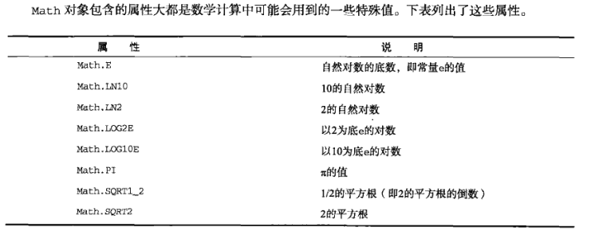
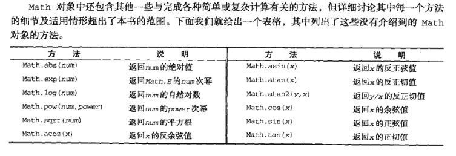
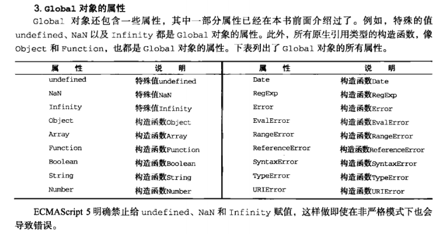
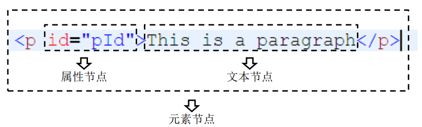

# JavaScript

尚硅谷前端学科全套教程
链接：https://pan.baidu.com/s/1BM_OKMXXAGxMNqaBN_7tRg 
提取码：afyt

[Introduction - 力扣加加 - 努力做西湖区最好的算法题解 (gitbook.io)](https://leetcode-solution-leetcode-pp.gitbook.io/leetcode-solution/)


- typeof

- instanceof


## Object


## Array

- **push()**		

  - 向数组的末尾添加一个或更多元素，并返回新的长度。

- **pop()**

  - 删除并返回数组的最后一个元素

- **shift()**

  - 删除并返回数组的第一个元素

- **unshift()**

  - 向数组的开头添加一个或更多元素，并返回新的长度。


- **reverse()**
- **sort()**


- **concat()**

  - 连接两个或更多的数组，并返回结果

- **slice()**

   ```javascript
    # 从某个已有的数组返回选定的元素
    slice(start,end)
    返回一个新的数组，包含从 start 到 end （不包括该元素）的 arrayObject 中的元素。
   ```

- ##### splice()

  ```js
  # 删除	可以删除任意数量的项		需要2个参数
  splice(索引，要删除的项数)
  	const arr = [1,2,3,4]
  	arr.splice(1,2)		// arr = [1,4]
  
  
  # 插入	可以在指定位置插入任意数量的项		需要3个参数	
  splice(起始位置，0 （要删除的项数）, 要插入的项)	// 插入时第二个参数为0
  	const arr = [1,2,3,4]
  	arr.splice(1,0,5,6,7)		// arr = [1,5,6,2,3,4]
  
  
  # 替换	可以在指定位置替换任意数量的项，且同时删除任意数量的项		需要3个参数
  splice(起始位置，要删除的项数, 要插入的项)	// 删除项和插入项数目不需要相等
  	const arr = [1,2,3,4]
  	arr.splice(1,2,5,6,7)		// arr = [1,5,6,7,4]
  
  ```


- **indexOf()**

- **lastIndexOf()**

  ```js
  # indexOf() 从头开始查找  lastIndexOf() 从末尾开始查找
  
  const numbers = [1,2,3,4,5,4,3,2,1]
      
  # indexOf(查找的项)
  	numbers.indexOf(3)	// 2
  # indexOf(查找的项, 查找的起点索引位置)
  	numbers.indexOf(3, 4)	// 6
  ```


- **迭代**

  ```js
  # filter()
  
  # forEach()
  
  # map()
  
  # some()
  
  # every()
  
  
  ```


- **reudce()**
- **reduceRight()**


## Date


## Math





```js
# min()
# max()

# ceil()	向上取整
	Math.ceil(25.9)	// 26
	Math.ceil(25.1)	// 26
# floor()	向下取整
	Math.floor(25.9)	// 25
	Math.floor(25.1)	// 25
# round()	四舍五入
    Math.round(25.9)	// 26
    Math.round(25.1)	// 25

# random()	返回0到1之间的随机数，不包括0和1
	值 = Math.floor(Math.random() * 可能值的总数 + 第一个可能出现的值)
    1-10	Math.floor(Math.random() * 10 + 1)
	3-13	Math.floor(Math.random() * 10 + 3)
```


## String

```js
# charAt()		charCodeAt()
	const str = 'hello'
    str.charAt(1)	// 'e'
	str.charCodeAt(1)	// '101'
	str[1]	//  'e' (注：浏览器版本)

# concat()

# slice()	substr()	substring()

# indexOf()		lastIndexOf()

# trim()	trimLeft()	trimRight()

# toLowerCase()		toUpperCase()
```


## Global




# DOM


### 节点

- 节点：Node——构成HTML文档最基本的单元。

-  常用节点分为四类

  - – 文档节点：整个HTML文档
  - – 元素节点：HTML文档中的HTML标签
  - – 属性节点：元素的属性
  - – 文本节点：HTML标签中的文本内容

  


### 获取节点

- **获取元素节点**

  ```js
  # 通过document对象调用
  1. getElementById()
  	– 通过id属性获取一个元素节点对象
      
  2. getElementsByTagName()
  	– 通过标签名获取一组元素节点对象
      
  3. getElementsByName()
  	– 通过name属性获取一组元素节点对象
  ```


- **获取元素节点的子节点**

  ```javascript
  #  通过具体的元素节点调用
  1. getElementsByTagName()
     – 方法，返回当前节点的指定标签名后代节点
     
  2. childNodes
     – 属性，表示当前节点的所有子节点
     
  3. firstChild
     – 属性，表示当前节点的第一个子节点
     
  4. lastChild
     – 属性，表示当前节点的最后一个子节点
  ```

- **获取父节点和兄弟节点**

  ```js
  #  通过具体的节点调用
  1. parentNode
  	– 属性，表示当前节点的父节点
      
  2. previousSibling
  	– 属性，表示当前节点的前一个兄弟节点
      
  3. nextSibling
  	– 属性，表示当前节点的后一个兄弟节点
  ```


- **document**

  ```js
  # 保存body的引用
  	document.body 
  
  # 保存html根标签
  	document.documentElement
  
  # 页面中所有的元素
  	document.all
  
  # 根据元素的class属性值查询一组元素节点对象
  	document.getElementsByClassName("");
  
  # document.querySelector()
  /*
   * document.querySelector()
   * 	- 需要一个选择器的字符串作为参数，可以根据一个CSS选择器来查询一个元素节点对象
   * 	- 虽然IE8中没有getElementsByClassName()但是可以使用querySelector()代替
   * 	- 使用该方法总会返回唯一的一个元素，如果满足条件的元素有多个，那么它只会返回第一个
   */
  
  # document.querySelectorAll()
  /*
   * document.querySelectorAll()
   * 	- 该方法和querySelector()用法类似，不同的是它会将符合条件的元素封装到一个数组中返回
   * 	- 即使符合条件的元素只有一个，它也会返回数组
   */
  ```

- **操作样式**

  ```js
  # 内联样式
  	元素.style.样式名 = 样式值
  
  # IE(只有IE支持)
  	元素.currentStyle.样式名
  
  # 其他(IE8以上)
  	getComputedStyle()	// getComputedStyle(box1,null)
  /*
   * 在其他浏览器中可以使用
   * 		getComputedStyle()这个方法来获取元素当前的样式
   * 		这个方法是window的方法，可以直接使用
   * 需要两个参数
   * 		第一个：要获取样式的元素
   * 		第二个：可以传递一个伪元素，一般都传null
   * 
   * 该方法会返回一个对象，对象中封装了当前元素对应的样式
   * 	可以通过对象.样式名来读取样式
   * 	如果获取的样式没有设置，则会获取到真实的值，而不是默认值
   * 	比如：没有设置width，它不会获取到auto，而是一个长度
   * 
   * 但是该方法不支持IE8及以下的浏览器
   * 
   * 通过currentStyle和getComputedStyle()读取到的样式都是只读的，
   * 	不能修改，如果要修改必须通过style属性
   */
  
  ```

  ```js
  ### Element 对象 ### 
  
  # clientWidth
  # clientHeight
  /*
   * 	- 这两个属性可以获取元素的可见宽度和高度
   * 	- 这些属性都是不带px的，返回都是一个数字，可以直接进行计算
   * 	- 会获取元素宽度和高度，包括内容区和内边距，不包括边框
   *  - 这些属性都是只读的，不能修改
   */
  
  
  # offsetWidth
  # offsetHeight
  /*
   * 	- 获取元素的整个的宽度和高度，包括内容区、内边距和边框
   */
  # offsetLeft
  # offsetTop
  /*
   * offsetLeft
   * 	- 当前元素相对于其定位父元素的水平偏移量
   * offsetTop
   * 	- 当前元素相对于其定位父元素的垂直偏移量
   */
  # offsetParent
  /*
   * 	- 可以用来获取当前元素的定位父元素
   *  - 会获取到离当前元素最近的开启了定位的祖先元素
   * 		如果所有的祖先元素都没有开启定位，则返回body
   */
  
  
  # scrollWidth
  # scrollHeight
  /*
   * 	- 可以获取元素整个滚动区域的宽度和高度
   */
  # scrollLeft
  # scrollTop
  /*
   * scrollLeft
   * 	- 可以获取水平滚动条滚动的距离
   * scrollTop
   * 	- 可以获取垂直滚动条滚动的距离
   */
  
  # 当满足 scrollHeight - scrollTop == clientHeight
  # 说明垂直滚动条滚动到底了
  
  # 当满足 scrollWidth - scrollLeft == clientWidth
  # 说明水平滚动条滚动到底
  
  
  ```


# BOM


# 事件

## 事件对象

- 参考文章
  - [js中（event）事件对象 - 萌新萌新很萌 - 博客园 (cnblogs.com)](https://www.cnblogs.com/dcyd/p/12482989.html)
  - [你真的理解 事件冒泡 和 事件捕获 吗？ (juejin.cn)](https://juejin.cn/post/6844903834075021326)
  - [事件及事件绑定 && 事件对象及事件传播——基础知识（脑图梳理） (juejin.cn)](https://juejin.cn/post/6844904144587718664)

- 当事件的响应函数被触发时，浏览器每次都会将一个事件对象作为实参传递进响应函数,在事件对象中封装了当前事件相关的一切信息，比如：鼠标的坐标  键盘哪个按键被按下  鼠标滚轮滚动的方向。

  ```js
  # 在IE8中，响应函数被触发时，浏览器不会传递事件对象，
  # 在IE8及以下的浏览器中，是将事件对象作为window对象的属性保存的
  
  # clientX	可以获取鼠标指针的水平坐标
  # cilentY	可以获取鼠标指针的垂直坐标
  
  Div.onmousemove = function(event){
  
      //解决事件对象的兼容性问题
      event = event || window.event;
  
      /*
  	 * clientX可以获取鼠标指针的水平坐标
  	 * cilentY可以获取鼠标指针的垂直坐标
  	 */
      var x = event.clientX;
      var y = event.clientY;
  
  };
  		
  ```


### onscroll

```js
# 在元素的滚动条滚动时触发
```


## 鼠标事件


### onclick

```js
# 点击（移动端click被识别为单击）
```


### ondblclick

```js
# 双击（大概是在 300ms 之间点击两次）
```


### oncontextmenu

```js
# 右键点击
```


### onmousemove

```js
# 鼠标在元素中移动时被触发
```


### onmousedown

```js
# 鼠标按下
```


### onmouseup

```js
# 鼠标抬起
```


```js
// setCapture()	把下一次所有的鼠标按下相关的事件捕获到自身上,只有IE支持
// releaseCapture()	
```


## 滚轮事件

```js
# onmousewheel	鼠标滚轮滚动
	- 火狐不支持
			bind(box1,"DOMMouseScroll",box1.onmousewheel);	// 火狐
	- 使用addEventListener()方法绑定响应函数，取消默认行为时不能使用return false，需要使用event来取消默认行为				  event.preventDefault();但是IE8不支持event.preventDefault();
	- event.preventDefault && event.preventDefault();
```


## 键盘事件

```js
# onkeydown
    - 按键被按下
	- 可以通过event.keyCode来获取按键的编码
    - 对于onkeydown来说如果一直按着某个按键不松手，则事件会一直触发
    - 当onkeydown连续触发时，第一次和第二次之间会间隔稍微长一点，其他的会非常的快，这种设计是为了防止误操作的发生。

# onkeyup
	- 按键被松开

// 键盘事件一般都会绑定给一些可以获取到焦点的对象或者是document
```


# 定时器

- https://www.cnblogs.com/xiaohuochai/p/5773183.html

```js
// 定时调用
# setInterval()
  	- 定时调用
  	- 可以将一个函数，每隔一段时间执行一次
 	- 参数：
  		1.回调函数，该函数会每隔一段时间被调用一次
  		2.每次调用间隔的时间，单位是毫秒
 	- 返回值：
		返回一个Number类型的数据，个数字用来作为定时器的唯一标识

# clearInterval()
	- 关闭一个定时器
	- 方法中需要一个定时器的标识作为参数，这样将关闭标识对应的定时器，clearInterval(timer);

// 延时调用
# setTimeout()

# clearTimeout()

```


- https://www.cnblogs.com/xiaohuochai/p/5777186.html

```js
# requestAnimationFrame
	- IE9浏览器不支持该方法，可以使用setTimeout来兼容
```


